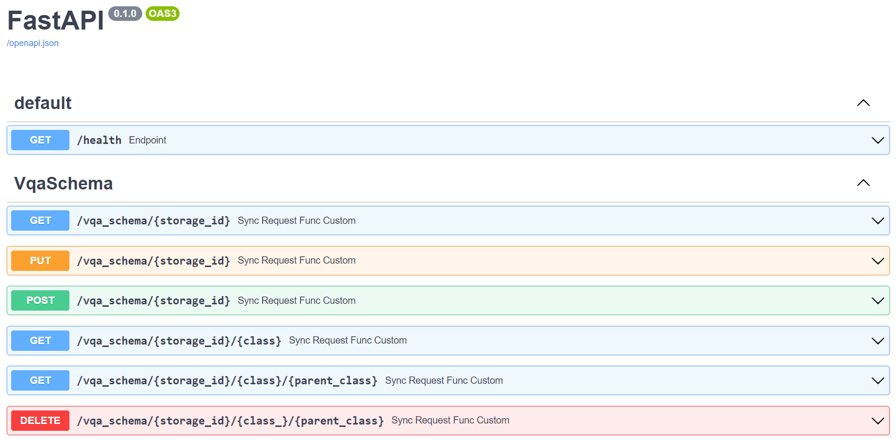
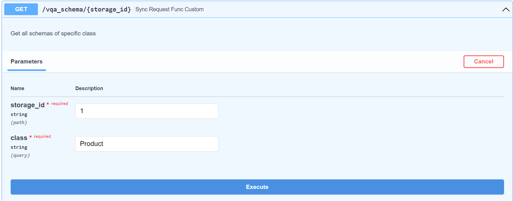
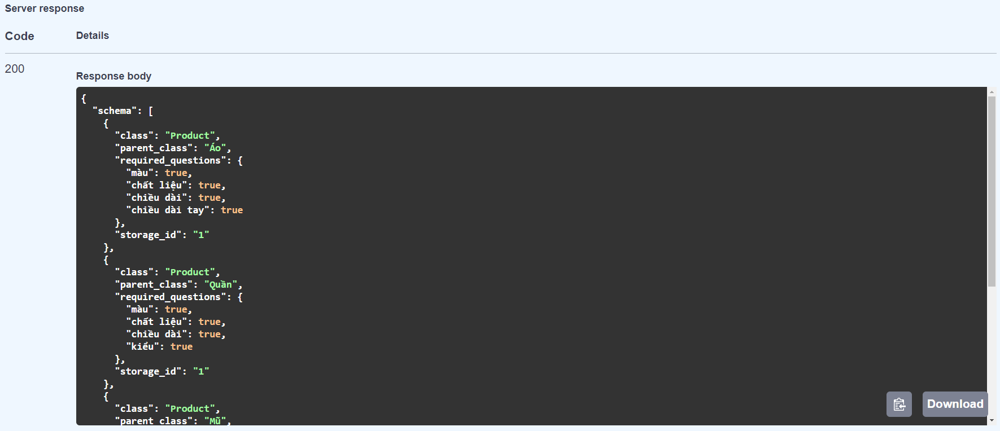
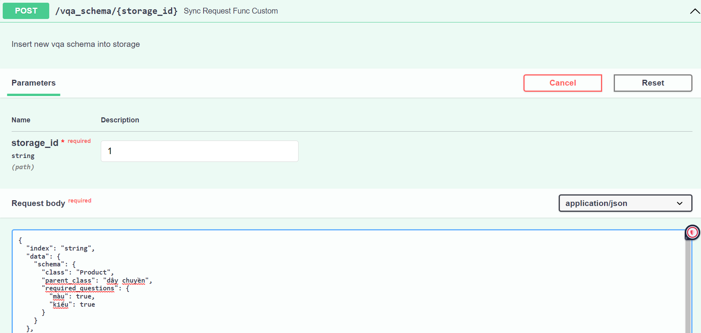
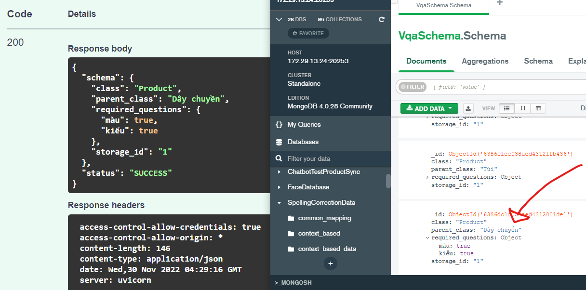
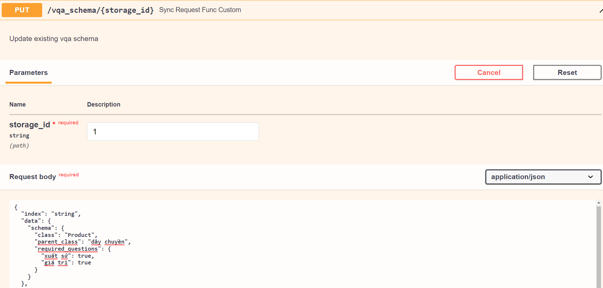
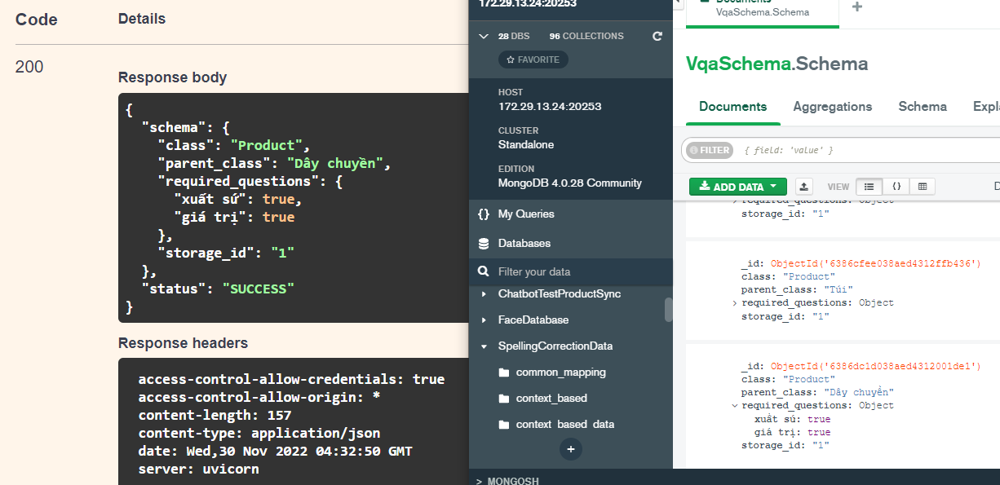
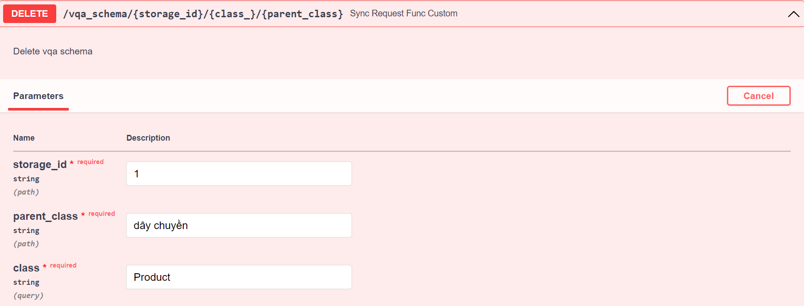
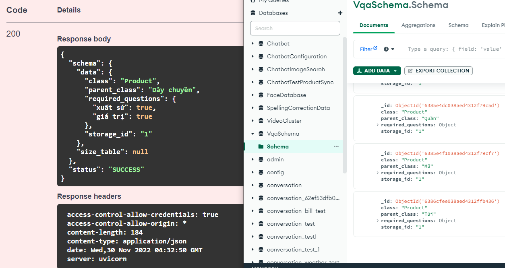

# API-Manager

A project to manage API CURD (create, read, update, delete) required questions for my <a href="https://github.com/ToDuyHung/Visual-Question-Answering" target="_blank">Visual-Question-Answering</a> project

## Table of contents
* [Requirements](#requirements)
* [Setup_environment](#setup_environment)
* [Setup_database](#setup_database)
* [Inference](#inference)
* [Usage](#usage)

## Requirements

- python 3.8
- pydantic~=1.8.2
- fastapi==0.85.0

## Setup_environment

1. Install default env (with tmtai_chatbot-0.0.7-py3-none-any.whl):

    ```
    pip install -r requirements.txt
    ```

2. To create and install your own env:

    ```
    cd ../common
    python setup.py bdist_wheel
    cd dist
    pip install tmtai_chatbot-0.0.7-py3-none-any.whl
    ```

## Setup_database

- MONGO_HOST and MONGO_PORT are stored at file ```VqaManager/.env```
- database name is stored at variable ```mongo_database``` in file ```VqaManager/config/config.py```
- collection name is stored at variable ```SCHEMA``` in file ```VqaManager/common/common_keys.py```

## Inference
    cd VqaManager
    python app_dev.py

## Usage

Start service and read documentations at http://localhost:8080/docs

1. General documentation interface

<p align="center">
  
</p>
<p align="center">
  <b>Figure 1:</b> General API CURD Interface
</p>

2. Get all schemas of specific class

<p align="center">
  
</p>
<p align="center">
  <b>Figure 2.1:</b> Get all schemas by storage_id and class name
</p>

<p align="center">
  
</p>
<p align="center">
  <b>Figure 2.2:</b> Response get all schemas by storage_id and class name
</p>

3. Insert schema

<p align="center">
  
</p>
<p align="center">
  <b>Figure 3.1:</b> Insert schema with storage_id, class name, parent class and required questions
</p>

<p align="center">
  
</p>
<p align="center">
  <b>Figure 3.2:</b> Response insert schema
</p>

4. Update existing schema

<p align="center">
  
</p>
<p align="center">
  <b>Figure 4.1:</b> Update existing schema with storage_id, class name, parent class and required questions
</p>

<p align="center">
  
</p>
<p align="center">
  <b>Figure 4.2:</b> Response update schema
</p>

5. Delete schema

<p align="center">
  
</p>
<p align="center">
  <b>Figure 5.1:</b> Delete schema by storage_id, class name and parent class
</p>

<p align="center">
  
</p>
<p align="center">
  <b>Figure 5.2:</b> Response delete schema by storage_id, class name and parent class